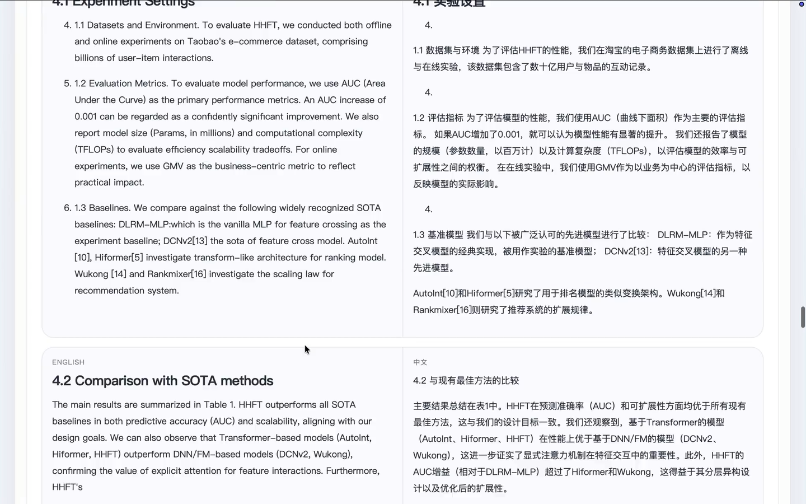

# Local AI Toolkit

一个面向本地环境的 OCR、翻译与文献阅读工具箱。

这个项目并不是从零开始“重新发明” OCR 和翻译模型，而是基于两个优秀的开源项目继续向上搭建应用层：

- [Tencent-Hunyuan/HY-MT](https://github.com/Tencent-Hunyuan/HY-MT)
- [zai-org/GLM-OCR](https://github.com/zai-org/GLM-OCR)

其中：

- `HY-MT` 提供本地翻译模型能力，是当前项目中英文双向翻译链路的核心基础
- `GLM-OCR` 提供 OCR 与版面解析能力，是当前项目文档识别链路的核心基础

在这两个上游项目之上，Local AI Toolkit 主要负责把能力组织成一条更完整的本地工作流：
把论文、扫描件或长文档接入本地 OCR 和翻译模型，再在一个更适合阅读的界面里完成查看、对照和整理。

## 演示

[](./demo.mp4)

点击上方封面图可查看演示视频：[`demo.mp4`](./demo.mp4)

## 当前能力

- `OCR 识别`
  支持图片与 PDF 输入，输出 Markdown 结果
- `翻译器`
  支持英文译中文、中文译英文
- `文献阅读`
  支持文档上传、任务轮询、阅读模式切换、中英对照查看
- `arXiv 导入`
  支持通过 arXiv 链接下载论文并进入文献阅读流程
- `文件夹管理`
  支持文档分类、文件夹重命名与删除
- `耗时统计`
  前端展示 OCR、翻译与总耗时

## 项目特点

- `本地优先`
  OCR 服务、翻译服务和应用层都可以在本地运行
- `围绕阅读体验设计`
  重点面向论文、扫描文档和长文本，而不是通用聊天场景
- `Markdown / 公式 / 表格友好`
  针对技术文档与公式较多的内容做了较多渲染处理
- `工作流清晰`
  从上传、OCR、翻译到阅读都收敛在一套统一界面中

## 项目结构

```text
.
├── app/
│   ├── backend/      # FastAPI 后端
│   ├── frontend/     # Vite 前端
│   ├── scripts/      # 本地开发脚本
│   └── data/         # 运行时数据：上传、输出、任务元数据
├── start_ocr_server.sh
├── start-hy-mt.sh
├── parse-with-glmocr.sh
└── run-with-monitor.sh
```

## 架构说明

整个仓库可以理解为两层：

1. 模型服务层
   - OCR 服务
   - 翻译服务
2. 应用层
   - `app/backend`：API、任务编排、结果管理
   - `app/frontend`：工具界面、阅读界面、任务列表

当前应用默认假设：
你已经在本地准备好了 OCR 模型服务和翻译模型服务，并通过 HTTP 接口对外提供能力。

## 技术栈

- 后端：FastAPI、httpx、pydantic-settings
- 前端：Vite、原生 JavaScript、marked、KaTeX、DOMPurify
- Python 环境：`uv`

## 运行要求

- Python `3.11+`
- Node.js `18+`
- `uv`
- 可用的本地 OCR 服务
- 可用的本地翻译服务

## 硬件建议

从当前依赖的两个上游项目来看，这个项目的本地部署门槛并不算特别高，但仍然建议具备一定的本地推理条件。

一个比较实用、也比较贴近当前项目定位的描述方式是：

- `Apple Silicon Mac`
  对于 Mac 用户，M 系列芯片是比较合适的选择。`GLM-OCR` 官方仓库提供了面向 Apple Silicon 的 `mlx-vlm` 部署入口，`HY-MT` 的 1.8B 量化模型也更适合这类本地设备部署。
- `带独立显卡的普通笔记本 / 台式机`
  如果是 Windows 或 Linux 环境，带 NVIDIA GPU 的机器会更合适。`GLM-OCR` 官方仓库提供了基于 `vLLM / SGLang` 的自部署方案，也支持将版面分析放在指定 GPU 或 CPU 上运行。
- `纯 CPU 环境`
  理论上部分链路可以运行，但整体体验通常不理想，尤其在 OCR、长文档解析和连续翻译场景下，速度会明显受限，因此不建议把纯 CPU 机器作为主要使用环境。

如果用一句更简洁的话来概括：

`一台 M 系列 Mac，或者一台带独立显卡的普通笔记本，通常就可以把这个项目跑起来。`

## 快速开始

### 1. 启动模型服务

启动 OCR 服务：

```bash
./start_ocr_server.sh
```

启动翻译服务：

```bash
./start-hy-mt.sh
```

如果你已经把依赖和模型都准备好了，也可以直接一键启动全部服务：

```bash
./start-all.sh
```

这个脚本会在后台拉起 OCR、翻译服务、后端、前端，并把日志写到 `./.runtime/logs/`。
常用辅助命令：

```bash
./start-all.sh status
./start-all.sh stop
./start-all.sh restart
```

这两个脚本已经尽量做成了通用形式，但你仍然需要根据自己的本地模型路径调整环境变量，例如：

- `SERVER_DIR`
- `LLAMA_SERVER_BIN`
- `MODEL_PATH`

### 2. 准备后端环境

```bash
uv venv app/.venv

app/.venv/bin/pip install \
  fastapi \
  httpx \
  pydantic-settings \
  python-multipart \
  uvicorn

cp app/backend/.env.example app/backend/.env
```

### 3. 安装前端依赖

```bash
cd app/frontend
npm install
cd ../..
```

### 4. 启动后端

```bash
./app/scripts/dev_backend.sh
```

### 5. 启动前端

```bash
./app/scripts/dev_frontend.sh
```

### 6. 打开应用

- 前端：`http://localhost:5173`
- 后端：`http://localhost:8000`
- 健康检查：`http://localhost:8000/api/health`

## 配置说明

后端环境变量示例见：

- `app/backend/.env.example`

比较关键的配置项包括：

- `LOCAL_AI_OCR_BASE_URL`
- `LOCAL_AI_OCR_CHAT_PATH`
- `LOCAL_AI_OCR_MODEL`
- `LOCAL_AI_TRANSLATE_BASE_URL`
- `LOCAL_AI_TRANSLATE_CHAT_PATH`
- `LOCAL_AI_TRANSLATE_MODEL`
- `LOCAL_AI_TRANSLATE_RETRY_ATTEMPTS`
- `LOCAL_AI_TRANSLATE_MAX_CHARS_PER_CHUNK`

## API 概览

当前后端主要接口包括：

- `GET /api/health`
- `POST /api/ocr`
- `POST /api/translate`
- `POST /api/upload`
- `POST /api/upload/url`
- `GET /api/tasks`
- `GET /api/task/{id}`
- `PATCH /api/task/{id}`
- `PATCH /api/folder/rename`
- `POST /api/folder/delete`
- `GET /api/result/{doc_name}`

## 当前适用场景

这个项目当前更适合以下任务：

- 论文阅读
- 扫描版 PDF 识别
- 英文技术文档翻译
- OCR 结果整理与二次阅读
- 中英对照精读

它目前并不追求：

- 通用浏览器抓取
- 商业级 SaaS 部署
- 多租户平台化能力
- 在线托管推理服务

## 许可证

本仓库使用一份“非商业使用”的源码许可证，完整条款见：

- [LICENSE](./LICENSE)

你可以：

- 个人使用
- 学术研究使用
- 教学使用
- 非商业修改与分发

你不可以：

- 直接或间接将本项目用于商业用途
- 将本项目接入付费产品或付费服务
- 将本项目作为商业服务的一部分进行托管、售卖或再授权

需要特别说明的是：
由于该许可证限制了商业使用，因此它并不属于严格法律意义上的 OSI 标准开源许可证，更准确地说，它是“公开源码 / source-available”项目。

## Roadmap

- 提升 OCR 与翻译链路的稳定性
- 改进公式密集型论文的阅读体验
- 优化文档管理与归档体验
- 完善部署与发布流程

## 贡献

欢迎提交 Issue 与讨论想法。

如果你想提交较大的代码改动，建议先开 Issue 对齐方向，以避免和项目当前路线偏离太远。

## 致谢

本项目建立在本地模型工作流之上，运行时依赖你自行部署的 OCR / 翻译模型服务。

如果你在本项目中使用了第三方模型权重、外部推理框架或其他工具，请同时关注它们各自的许可证与使用条款。

## 参考项目

- [Tencent-Hunyuan/HY-MT](https://github.com/Tencent-Hunyuan/HY-MT)
- [zai-org/GLM-OCR](https://github.com/zai-org/GLM-OCR)
